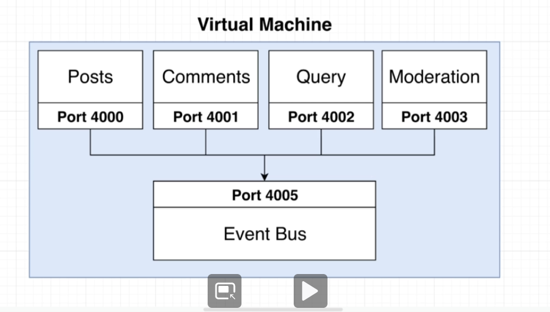

# Microservices Exercises Blog
Create a blog using microservices and event-bus/broker for asynchronous communication between services.

Understanding and learning how microservices are built.

## Technical Documentation

